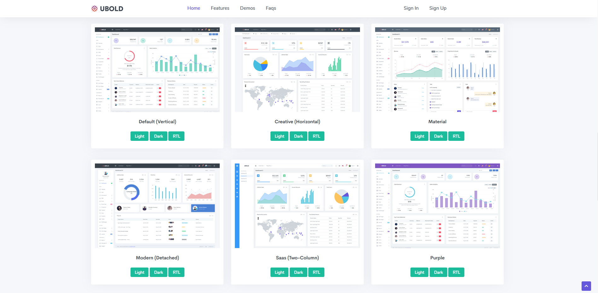
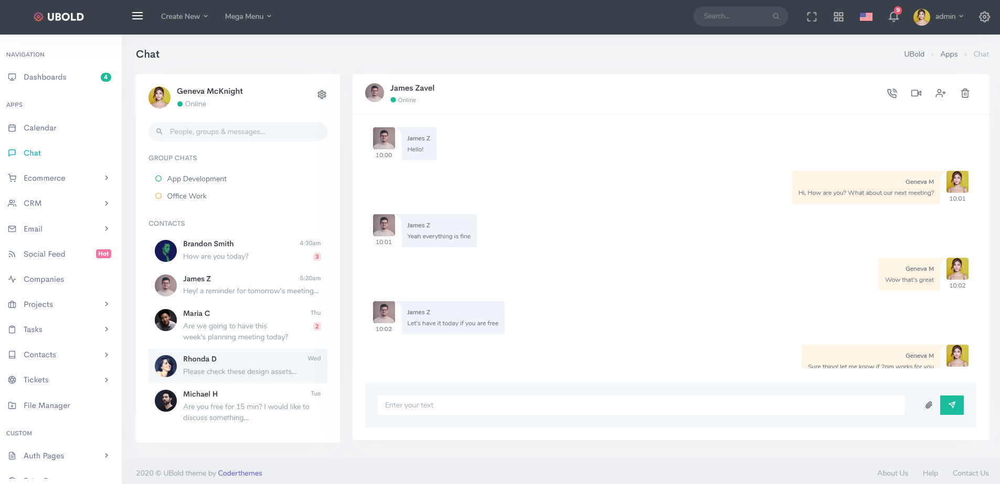
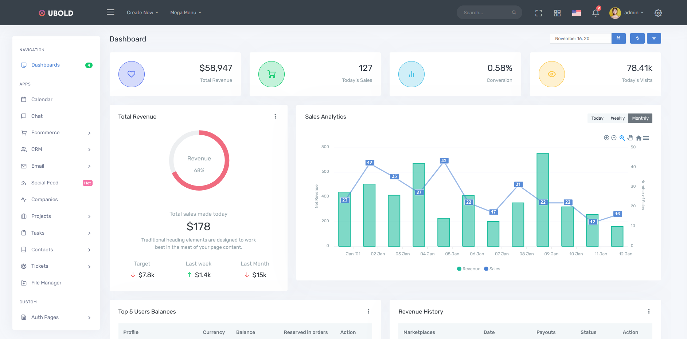

<h1 align="center">Laravel-Bootstrap-Ui-kit</h1>

## Screens
<p align="center">



</p>


- Including the Detached Layout ( new feature of Ubold ), all of the new features of the Ubold template are contained in this kit.


## How to use
To clone and run this application, you'll need [Git](https://git-scm.com/downloads) installed on your computer. From your command line:

```$bash
# Clone this repository
$ git clone https://github.com/Tortu-Ch/Ubold-Laravel-Boostrap-UI-Kit.git

# composer install
# php artisan key:generate 
# configure the .env file to suit your server
# php artisan migrate:refresh --seed
# php artisan serve

If you have any issue, you are welcome any time.
